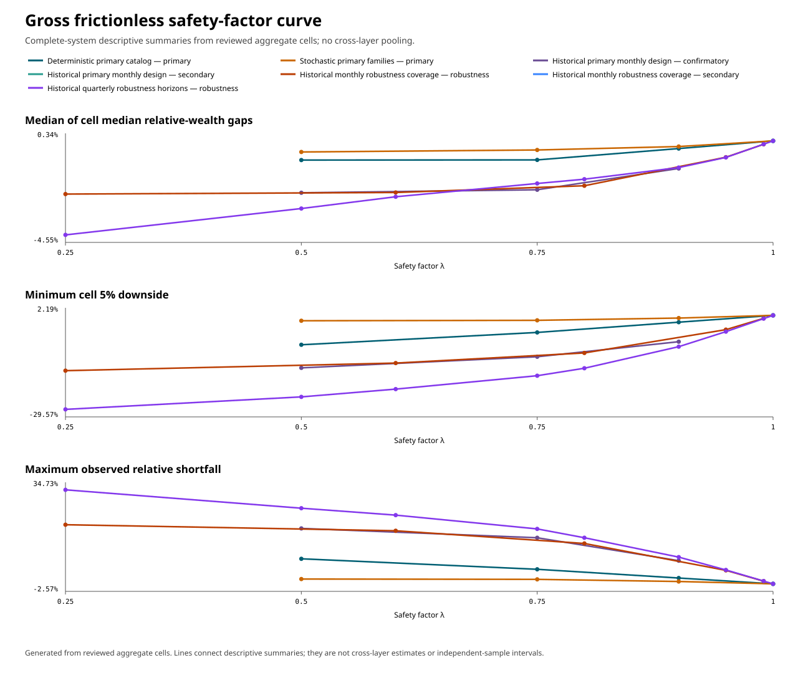
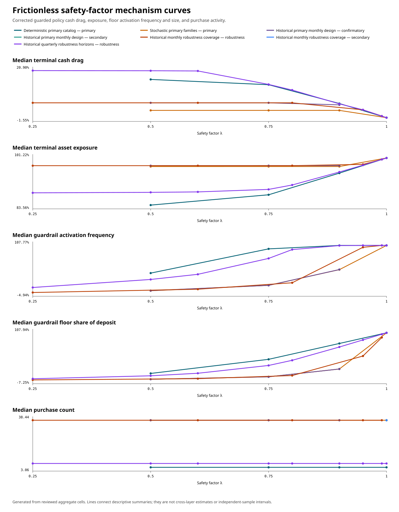
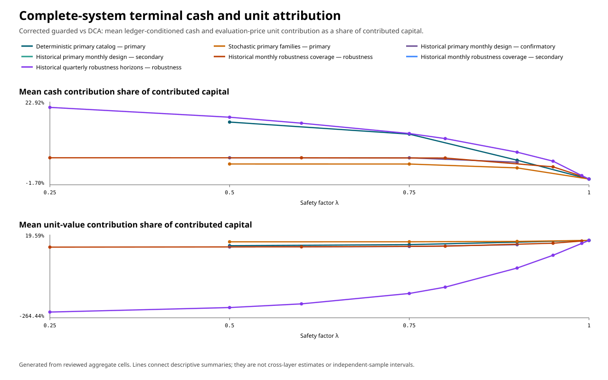
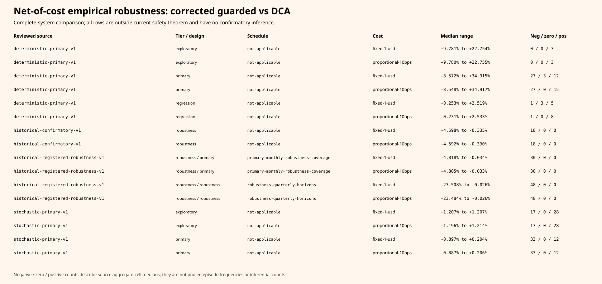

# Safety-adaptivity trade-off synthesis

Publication status: **publication-ready**. Cleared as the thesis-facing
empirical checkpoint by the [independent empirical-package review](../../research/notes/safety-adaptivity-empirical-package-review.md).

## Question

What conclusion about guarded corrected-mean SmartDCA is jointly supported by
the reviewed deterministic, stochastic, and historical evidence, and which
observations belong to the complete system, the corrected-mean signal, or the
safety architecture?

## Result

The evidence supports safety without an empirical superiority claim. The
[sharp epsilon-DCA unit guardrail](../../research/theorems/epsilon-dca-safety-unit-guardrail.md)
supplies the model-free frictionless relative-wealth floor, while the adaptive
score controls only the funded discretionary interval. Realized performance is
path- and parameter-sensitive in the deterministic and controlled stochastic
layers. In the sealed historical layer, all 18 non-unit primary frictionless
complete-system medians were negative and nine H1 cells rejected the two-sided
zero null after Holm adjustment over the full 36-cell H1/H2 family.[^synthesis-audit]

The corrected-mean signal did not establish incremental historical value. Its
comparison with the neutral guarded selector had 17 negative and one positive
median among the 18 registered cells, with no Holm-significant H2 result. This
is not evidence of equivalence or proof that the signal is zero. The neutral
safety architecture also had 18 negative medians against DCA, but that
secondary comparison is descriptive and is not a causal decomposition of the
complete-system effect.[^synthesis-audit]

These findings concern the declared SPY adjusted-close and BTC-USD proxy
series obtained under the reviewed Yahoo Finance source seam.[^provider] The
historical windows overlap. Only the registered circular moving-block
bootstrap and sealed Holm procedure support the primary inferential
statements; cell counts, descriptive ranges, robustness rows, and cross-layer
signs must not be treated as independent observations or pooled estimates.

## Reproducible evidence package

Immutable synthesis run
[`smartdca-synthesis-v1-394aa4d22f52ec12aca69679780670d49caa671d5935963869f41c1b5b557f26`](runs/smartdca-synthesis-v1-394aa4d22f52ec12aca69679780670d49caa671d5935963869f41c1b5b557f26/manifest.json)
is generated from one [versioned synthesis
manifest](../../experiments/inputs/safety-adaptivity-synthesis-v1.json). It
accepts only the exact reviewed manifests and review records for:

- the deterministic primary catalog;
- the seeded stochastic families;
- the sealed confirmatory historical run; and
- the separately identified registered historical robustness run.

The source gate validates every manifest, selected aggregate, review record,
registered uncertainty artifact, and reconciliation receipt by SHA-256 before
producing output. It normalized all 2,754 reviewed aggregate cells without
pooling them. The generated [source
validation](runs/smartdca-synthesis-v1-394aa4d22f52ec12aca69679780670d49caa671d5935963869f41c1b5b557f26/source-validation.json),
[claim
receipts](runs/smartdca-synthesis-v1-394aa4d22f52ec12aca69679780670d49caa671d5935963869f41c1b5b557f26/claim-receipts.json),
and [summary
reconciliation](runs/smartdca-synthesis-v1-394aa4d22f52ec12aca69679780670d49caa671d5935963869f41c1b5b557f26/summary-reconciliation.json)
make the route from source aggregates to every table and numerical conclusion
machine-readable. Historical episode rows remain private under their existing
cryptographic receipts; the reviewed source audit independently reconciled
them to the public aggregates before this synthesis consumed those aggregates.
[^historical-audit][^empirical-layers]

## Three comparisons kept separate

This table is generated from the same normalized evidence as the figures and
prose. A “cell” retains its source-specific meaning; signs in the fixed
deterministic catalog are not frequencies, and the three stochastic seeds per
family do not define a population.

| Evidence slice | Analysis tier | Comparison | Cells | N/cell min–max | Negative / zero / positive medians | Median range | Holm significant | Boundary |
|---|---|---|---:|---:|---:|---:|---:|---|
| Deterministic primary catalog at lambda=0.75 | primary | Complete-system performance | 14 | 1–1 | 9 / 1 / 4 | -4.978% to +26.105% | not registered | fixed catalog; signs are not frequencies |
| Deterministic primary catalog at lambda=0.75 | primary | Corrected-mean signal contribution | 14 | 1–1 | 5 / 1 / 8 | -2.901% to +1.520% | not registered | fixed catalog; signs are not frequencies |
| Deterministic primary catalog at lambda=0.75 | primary | Safety-architecture behavior | 14 | 1–1 | 10 / 1 / 3 | -4.526% to +29.873% | not registered | fixed catalog; signs are not frequencies |
| Stochastic primary families at 60 months and lambda=0.75 | primary | Complete-system performance | 5 | 3–3 | 3 / 0 / 2 | -0.773% to +0.115% | not registered | three saved seeds per family; no population inference |
| Stochastic primary families at 60 months and lambda=0.75 | primary | Corrected-mean signal contribution | 5 | 3–3 | 1 / 0 / 4 | -0.029% to +0.071% | not registered | three saved seeds per family; no population inference |
| Stochastic primary families at 60 months and lambda=0.75 | primary | Safety-architecture behavior | 5 | 3–3 | 3 / 0 / 2 | -0.745% to +0.095% | not registered | three saved seeds per family; no population inference |
| Historical primary non-unit frictionless cells | confirmatory | Complete-system performance | 18 | 72–383 | 18 / 0 / 0 | -4.593% to -0.335% | 9 / 18 | overlapping windows; registered block-bootstrap inference only for H1/H2 |
| Historical primary non-unit frictionless cells | confirmatory | Corrected-mean signal contribution | 18 | 72–383 | 17 / 0 / 1 | -0.545% to +0.052% | 0 / 18 | overlapping windows; registered block-bootstrap inference only for H1/H2 |
| Historical primary non-unit frictionless cells | secondary | Safety-architecture behavior | 18 | 72–383 | 18 / 0 / 0 | -4.365% to -0.340% | not registered | overlapping windows; registered block-bootstrap inference only for H1/H2 |
| Historical monthly robustness coverage cells | robustness | Complete-system performance | 30 | 72–383 | 30 / 0 / 0 | -4.813% to -0.034% | not registered | descriptive only; no uncertainty or multiplicity test |
| Historical monthly robustness coverage cells | robustness | Corrected-mean signal contribution | 30 | 72–383 | 30 / 0 / 0 | -0.5836% to -0.0002% | not registered | descriptive only; no uncertainty or multiplicity test |
| Historical monthly robustness coverage cells | robustness | Safety-architecture behavior | 30 | 72–383 | 30 / 0 / 0 | -4.722% to -0.034% | not registered | descriptive only; no uncertainty or multiplicity test |
| Historical quarterly robustness horizon cells | robustness | Complete-system performance | 48 | 4–130 | 48 / 0 / 0 | -23.484% to -0.026% | not registered | descriptive within schedule; no uncertainty or multiplicity test |
| Historical quarterly robustness horizon cells | robustness | Corrected-mean signal contribution | 48 | 4–130 | 40 / 0 / 8 | -9.216% to +0.057% | not registered | descriptive within schedule; no uncertainty or multiplicity test |
| Historical quarterly robustness horizon cells | robustness | Safety-architecture behavior | 48 | 4–130 | 48 / 0 / 0 | -15.718% to -0.026% | not registered | descriptive within schedule; no uncertainty or multiplicity test |

The quarterly robustness slice includes BTC-USD 120-month cells with only four
eligible episodes per cell. Those sparse cells are descriptive sensitivity
checks, not stable estimates or independent replication evidence.

The full generated [primary
tables](runs/smartdca-synthesis-v1-394aa4d22f52ec12aca69679780670d49caa671d5935963869f41c1b5b557f26/primary-tables.md)
also retain the complete safety-factor and net-cost summaries.

## Safety factor and mechanisms

The generated [safety-factor
data](runs/smartdca-synthesis-v1-394aa4d22f52ec12aca69679780670d49caa671d5935963869f41c1b5b557f26/safety-factor-curve.csv)
contain 81 figure-ready rows. For every declared evidence slice, coverage, and
comparison they report relative wealth, the minimum cell 5% downside, worst
observed shortfall, cash drag, asset exposure, guardrail activation frequency,
mean guardrail floor size as a share of the reviewed deposit, purchase
activity, and terminal cash and evaluation-price unit contributions. The
summaries are descriptive across source aggregate cells; the file explicitly
records that there is no cross-layer pooling.

Within each source aggregate cell, the floor-size field averages the mandatory
guardrail floor over every scheduled purchase step, retaining zero floors, and
divides that mean by the fixed per-period deposit. The cell ratio is therefore
the unconditional average mandatory floor per contribution event—equivalently,
that cell's total floors divided by its total contributed capital—not the
conditional size given activation. Each plotted point is the unweighted median
of its retained cell ratios, not a pooled ratio across the slice.





At \(\lambda=1\), both guarded policies collapse transaction by transaction to
DCA in every source run. The synthesis finds zero nonzero gaps across all 594
corresponding aggregate cells. Across the 612 frictionless aggregate cells
whose comparator is DCA, no observed minimum crossed its numerical
\(\lambda-1\) relative-gap floor. Those are cross-layer regression receipts for
the already proved guardrail, not a new empirical proof.[^guardrail]

Lower coverage leaves a larger funded discretionary interval, but it does not
create a monotone performance law. The deterministic catalog expands both
adverse and favorable extremes; stochastic signs and downside respond to the
chosen construction; and historical medians remain negative across primary
and registered robustness coverage. Cash drag, exposure, and activation move
with coverage; the mechanism figure reports both activation frequency and the
median floor share of each deposit. Their performance consequence still
depends on later prices.

## Terminal cash and unit attribution



Every source run had already checked the terminal-inventory identity. The
synthesis preserves raw cash, terminal-unit, and evaluation-price unit
components only at their original source-cell grain. Before a curve summary,
it divides each cash contribution \(H_T\) and unit-value contribution \(P U_T\)
by that cell's total contributed capital. The plotted dimensionless shares can
therefore be summarized across horizons without averaging raw dollar scales.
In every historical H1 aggregate the mean cash contribution is positive and
the mean unit contribution is negative; the negative unit value dominates.
Deterministic and stochastic examples contain both final signs, showing why
carried cash is neither inherently beneficial nor harmful.[^inventory][^synthesis-audit]

This is ledger-conditioned attribution. It does not make the guardrail or the
selector a causal explanation of market outcomes, and raw contribution scales
are not compared across different horizons or monthly and quarterly deposit
schedules.

## Gross safety and net costs

Frictionless rows alone audit the existing epsilon-DCA theorem. The two fee
routes are separately generated empirical robustness results with no
confirmatory test and are outside the current epsilon-DCA theorem.



The [cost-scope
data](runs/smartdca-synthesis-v1-394aa4d22f52ec12aca69679780670d49caa671d5935963869f41c1b5b557f26/cost-scope-summary.csv)
exclude the \(\lambda=1\) accounting boundary from their non-unit performance
summaries and keep deterministic, stochastic, primary historical, and
historical robustness sources separate. All cost-adjusted historical
complete-system medians were negative, but no theorem or new significance
claim follows from that finite observation.

## Agreement and disagreement across layers

The deterministic mechanisms and the terminal-inventory theorem agree with
the stochastic and historical accounting: carrying cash contributes
positively at evaluation, while fewer or differently timed units can offset
it. Deterministic rising, falling, rebound, crash, and hostile paths show both
directions and separate favorable architecture behavior from unfavorable
signal behavior. They establish possibility and failure mechanisms, not
market prevalence.[^deterministic]

The stochastic baselines likewise disagree in sign: at the displayed
60-month, \(\lambda=0.75\) slice the complete system has three negative and two
positive family medians, while the signal has one negative and four positive
family medians. The exploratory sensitivities change signs again. This agrees
with parameter and path sensitivity but does not predict historical results.
[^stochastic]

The historical layer is more uniformly negative for the declared rule and
data. That observation does not contradict the positive finite examples or
the safety theorem: the examples never supplied probabilities, and the theorem
is a floor rather than DCA dominance. Conversely, the historical result does
not prove universal inferiority. It narrows the empirical thesis claim to a
negative finding for the frozen evaluation.

## Thesis conclusion

In the project's full comparison model—causal, long-only, buy-only, fully
funded purchases; the same exogenous deposits and horizon; cash-inclusive
terminal wealth; and every finite positive price path—universal dominance
forces transaction-level DCA.[^impossibility] Weakening that demand to a
chosen factor \(\lambda\) yields the sharp epsilon-DCA unit guardrail and a
genuine funded discretionary interval.[^guardrail] The arbitrary-horizon
boundary then shows that every realized gap is the sum of terminal cash and
evaluation-price unit contributions.[^inventory]

The empirical study completes that chain without adding an optimality claim:
the guardrail enforces the frictionless floor, while adaptive freedom
changes exposure, cash, activation, and downside in path-dependent ways. The
frozen corrected-mean score did not show confirmed incremental historical
value, and its median relative-wealth gap against DCA was negative in all 18
non-unit primary frictionless historical cells. Guarded corrected-mean
SmartDCA is therefore an experimentally evaluated architecture with a proved
floor in the frictionless theorem model, not a universally superior,
empirically optimal, or presently validated return-improving strategy.

## Limitations and future questions

The study uses one primary corrected-mean configuration, two proxy series from
one provider seam, overlapping windows, five simple stochastic constructions
with three seeds each, a fixed deterministic catalog, six horizons across two
cadences, and two simple cost models. Robustness rows have no uncertainty
analysis, and the BTC-USD 120-month quarterly cells contain only four eligible
episodes each. The four preregistered alternate corrected-mean configurations
were not executed. SPY adjusted close and BTC-USD remain proxies with the
source and redistribution limits recorded in the provider review.[^provider]

Empirically motivated next questions are whether an independently specified
score avoids the observed unit shortfall, whether results reproduce on new
point-in-time data and non-overlapping evaluation periods, how alternate
corrected-mean configurations behave under a separately registered analysis,
and whether a cost-aware safety theorem or policy is desirable. A dynamic
guardrail, restricted price regime, or other new mathematical model would be a
new policy or theorem and must be proposed in a separately approved effort;
none is inferred from these exploratory patterns.

## Reproduction and publication state

With CPython 3.12 and a new empty output root:

```bash
python3.12 -m reproducibility.safety_adaptivity_synthesis \
  --manifest experiments/inputs/safety-adaptivity-synthesis-v1.json \
  --output-root /tmp/smartdca-synthesis-replay
python3.12 -m unittest \
  reproducibility.checks.check_safety_adaptivity_synthesis
```

The checkpoint regenerates the complete package byte for byte, validates every
output fingerprint, rejects pending or altered review state, and enforces the
collision/no-overwrite rule. The run identity binds the runtime implementation
and major/minor version, and the manifest omits patch-only version metadata.
The checkpoint confirms that changing only a mocked patch-version string does
not change the recorded runtime metadata; it does not assert identical
computation across arbitrary interpreter patch releases. The linked
[synthesis audit
note](../../research/notes/safety-adaptivity-tradeoff-synthesis-audit.md)
records the claim reconstruction and run-specific independent domain review.
The final empirical-package review separately reproduces the deterministic
study, the complete synthesis, and a registered historical slice; audits all
accepted identities and claims; and clears this synthesis for publication.

[^synthesis-audit]: Synthesis evidence: [cross-layer synthesis audit](../../research/notes/safety-adaptivity-tradeoff-synthesis-audit.md).
[^deterministic]: Deterministic evidence: [reviewed deterministic and adversarial report](deterministic-adversarial-paths.md).
[^stochastic]: Controlled stochastic evidence: [reviewed seeded-family report](seeded-stochastic-families.md) and [audit](../../research/notes/seeded-stochastic-family-evaluation-audit.md).
[^historical-audit]: Historical evidence: [confirmatory report](confirmatory-historical-evaluation.md) and [independent audit](../../research/notes/confirmatory-historical-evaluation-audit.md).
[^provider]: External-source boundary: [Yahoo Finance provider review](../../research/notes/yahoo-finance-historical-data-provider-review.md).
[^impossibility]: Mathematical boundary: [causal DCA dominance impossibility](../../research/theorems/causal-dca-dominance-impossibility.md) and [evidence note](../../research/notes/pathwise-dca-dominance-under-causal-budget.md).
[^guardrail]: Safety result: [sharp epsilon-DCA unit guardrail](../../research/theorems/epsilon-dca-safety-unit-guardrail.md) and [evidence note](../../research/notes/sharp-epsilon-dca-safety-guardrail.md).
[^inventory]: Attribution result: [arbitrary-horizon terminal-inventory boundary](../../research/theorems/arbitrary-horizon-performance-boundary.md) and [evidence note](../../research/notes/arbitrary-horizon-performance-boundary.md).
[^empirical-layers]: Artifact policy: [ADR 0008](../../docs/adr/0008-place-empirical-protocol-input-run-layers.md).
